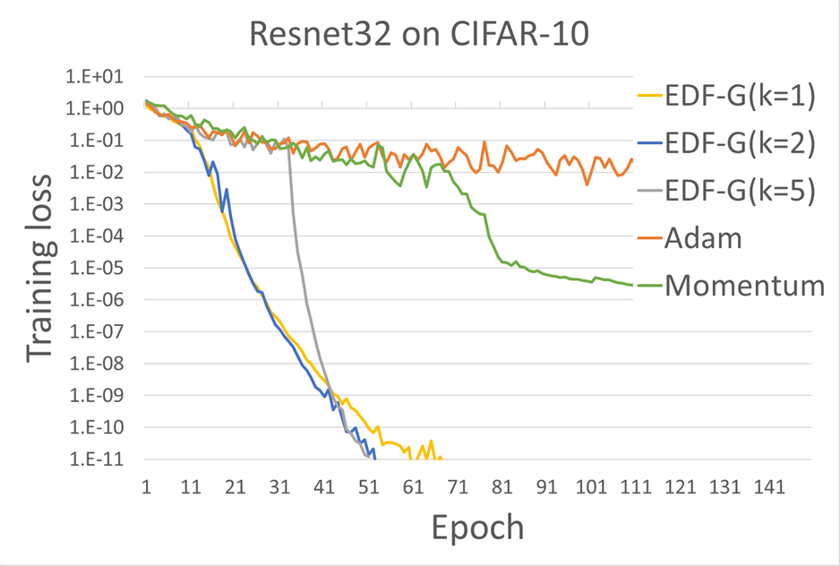
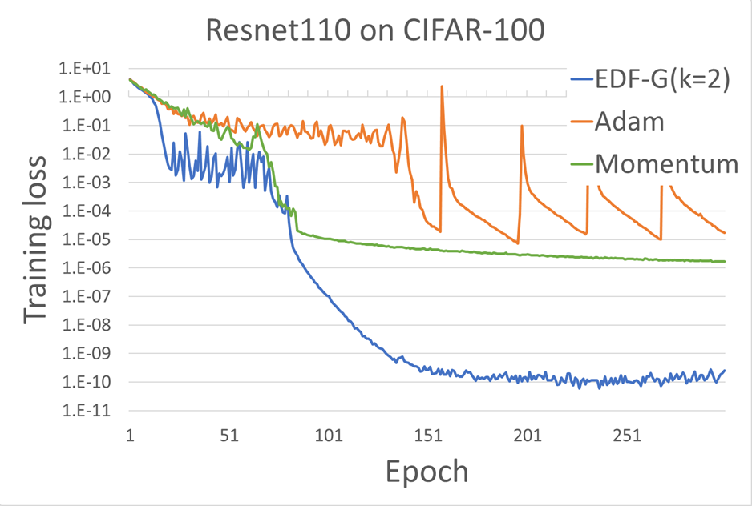

# Exponential Decaying Flows for Optimization
This repository contains examples of Exponential Decaying Flows (EDF) optimizer.
EDF can reduce training error to extremely small with mini-batch training for large size models.  



We are preparing to upload the paper for EDF.

# Requirements
### Hardware
You need 12GB GPU memory to train Resnet110 (We used Pascal TitanX for experiments).

### Software

- python2.7
- tensorflow-gpu (>=1.7)
- pandas
- python-opencv  (for duplicate_checker.py)

# Usage
### Download cifar10 or cifar100 dataset
Donwload [dataset](https://www.cs.toronto.edu/~kriz/cifar.html).
Our tools uses python version dataset.

### Cifar10 train
To reproduce the figure below, run train.py and collect the output file (written to output/parameter/loss_log.csv).  

```
python ./train.py --images ./data/cifar-10-batches-py/ \
                  --epoch 100 --batch 250 --block_per_layer 5 --optimizer edf \
                  --lr 3.5938136638
                  
python ./train.py --images ./data/cifar-10-batches-py/ \
                  --epoch 100 --batch 250 --block_per_layer 5 --optimizer momentum \
                  --lr 1.29154966501

python ./train.py --images ./data/cifar-10-batches-py/ \
                  --epoch 100 --batch 250 --block_per_layer 5 --optimizer adam \
                  --lr 0.01
                  
```
 


### Cifar100 train

To reproduce the figure below, 

1. make dataset without incorrectly labeled data (see Utility section)
2. run train.py
3. collect the output file (written to output/parameter/loss_log.csv).  

```
python ./train.py --cifar100 --images ./tmp/cifar100_pure/ \
                  --epoch 300 --batch 250 --block_per_layer 18 --optimizer edf \
                  --lr 3.5938136638
                  
python ./train.py --cifar100 --images ./tmp/cifar100_pure/ \
                  --epoch 300 --batch 250 --block_per_layer 18 --optimizer momentum \
                  --lr 1.29154966501

python ./train.py --cifar100 --images ./tmp/cifar100_pure/ \
                  --epoch 300 --batch 250 --block_per_layer 18 --optimizer adam \
                  --lr 0.00464158883361
                  
```
 




# Utility (duplication checker)
We found incorrectly labeled data in cifar-100.
Some files have a same image and different labels.

duplicate_checker.py detects the files and makes a dataset file, which
doesn't include incorrectly labeled data.


```
python duplicate_checker.py -i ~/data/cifar100/training/data/ -o ~/tmp/cifar100_pure
```


# License
EDF is released under the Apache 2.0 license.

This software includes the work that is distributed in the Apache License 2.0
(resnet_model.py)


